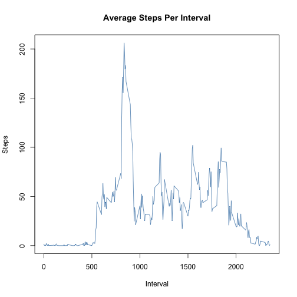
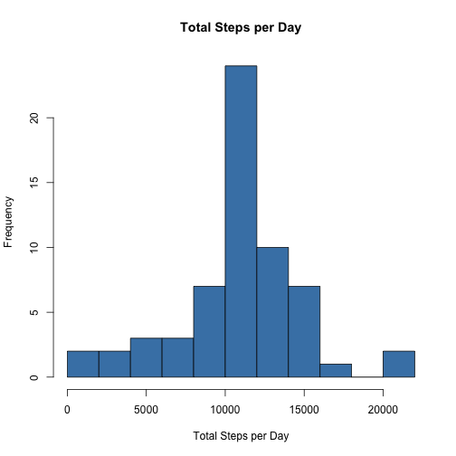

## Import required libraries

```r
library(lubridate)
library(dplyr)
library(ggplot2)
```

## Loading and preprocessing the data
Read the csv file and convert the dates to POSIXct objects using the libridate library.

```r
data <- read.csv("activity.csv")
data[,2] <- ymd(data[,2])
```

## What is mean total number of steps taken per day?and then find the average. 

```r
## Aggregate the daily totals
daily_totals <- aggregate(data$steps, by = list(Date = data$date), FUN = sum, na.rm = T)

## Create a histogram of Total Steps per Day 
hist(daily_totals[,2], breaks = 8, col = "steelblue", main = "Total Steps per Day", xlab = "Total Steps per Day")
```

 

```r
## Compute the mean and median
summary(daily_totals$x)
```

```
##    Min. 1st Qu.  Median    Mean 3rd Qu.    Max. 
##       0    6778   10400    9354   12810   21190
```

## What is the average daily activity pattern?

```r
## Compute the mean steps per interval
interval_means <- aggregate(data$steps, by = list(interval = data$interval), FUN = mean, na.rm = T)

## Create a plot of average steps vs. interval
plot(interval_means[,1], interval_means[,2], type = "l", col = "steelblue", main = "Average Steps Per Interval", xlab = "Interval", ylab = "Steps")
```

 

```r
## Which interval had the highest average activity?
arrange(interval_means, desc(x))[1,]
```

```
##   interval        x
## 1      835 206.1698
```

## Inputing missing values

```r
## Determine which rows contain missing values
is_na <- is.na(data[,1])
```


```
## [1] "There are 2304 missing values"
```

There are several ways the missing values in the data set could be replaced, depending on the level of accuracy required. The method I chose was to compute the average steps taken during each five minute interval across the whole data set. 

This assumes that the same interval of time between days is similar: if you walk from your car to the office on Monday at interval = 500, you do that every other day as well, and thus your step count should be similar. This method obviously falls short in that there is likely variance between peoples' daily schedules, particularly between weekdays and weekends.

The particular steps I took to compute these averages and replacing missing values is described in the code comments. 


```r
## Join the data and the interval averages so missing values can be 'copied' over
updated_data <- inner_join(data, interval_means)
```

```
## Joining by: "interval"
```

```r
updated_data[is_na,2] <- updated_data[is_na,4]

## Aggregate the daily totals
updated_daily_totals <- aggregate(updated_data$steps, by = list(Date = updated_data$date), FUN = sum, na.rm = T)

## Create a histogram of Total Steps per Day 
hist(updated_daily_totals[,2], breaks = 8, col = "steelblue", main = "Total Steps per Day", xlab = "Total Steps per Day")
```

 

```r
## Compute the mean and median
summary(updated_daily_totals[,2])
```

```
##    Min. 1st Qu.  Median    Mean 3rd Qu.    Max. 
##      41    9819   10770   10770   12810   21190
```
Filling in the missing values with the average for that interval significantly increases the mean and median values of the daily totals. 


## Are there differences in activity patterns between weekdays and weekends?

```r
## Determine which days are on the weekend
day <- weekdays(updated_data[,3])
weekends <- day == "Saturday" | day == "Sunday"

## Combine the data and days, the rename 'day' to either 'Weekday' or 'Weekend'
week_data <- data.frame(updated_data, day, stringsAsFactors = FALSE)
week_data[!weekends,5] <- "Weekday"
week_data[weekends,5] <- "Weekend"

## Average the steps per interval for 'Weekend' and 'Weekday'
week_totals <- aggregate(week_data$steps, by = list(Day = week_data[,5], Interval = week_data$interval), FUN = mean, na.rm = T)

## Create 2-panel line chart of average steps per interval for each day type
qplot(Interval, x, data = week_totals, geom = "line", facets = Day ~ .)
```

 

While weekdays have an interval with the highest average step count, there are more overall steps taken on the weekend.

```
##       Day        x
## 1 Weekday 10255.85
## 2 Weekend 12201.52
```

